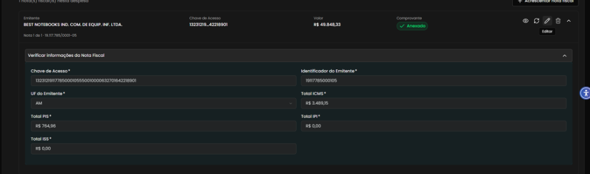
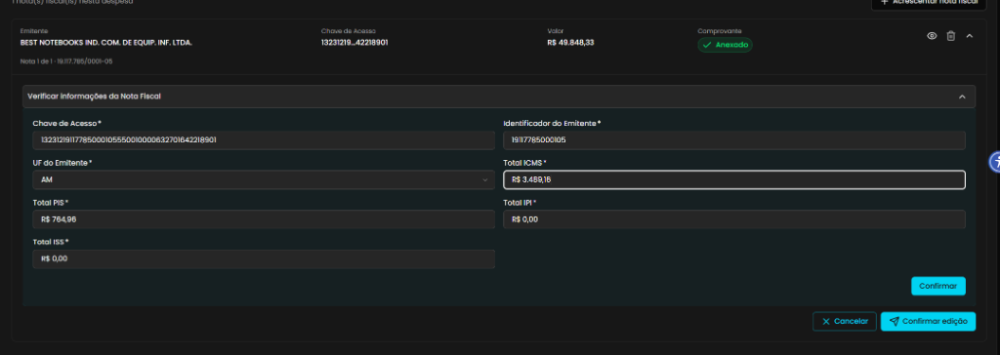
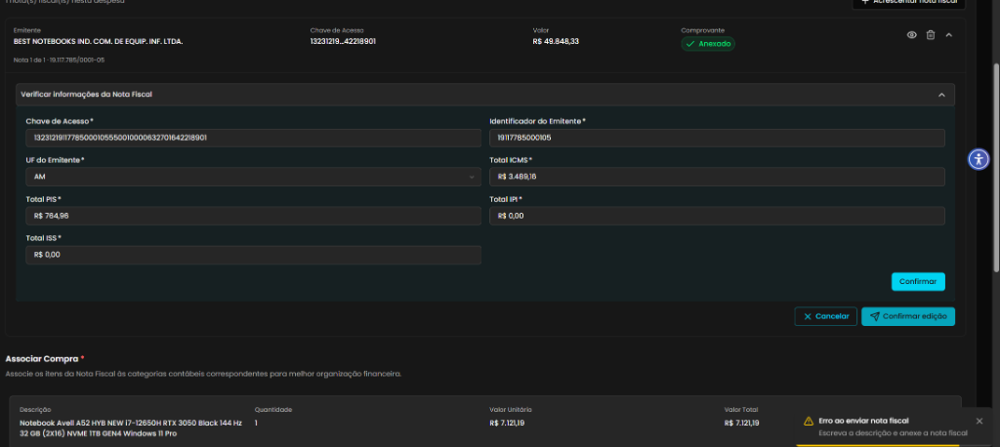

## Título
Botão "Confirmar" inoperante e erro "Escreva a descrição e anexe a nota fiscal" ao acionar "Confirmar edição" em Nota Fiscal já anexada

## ID
BUG-M014-FO-NF-018

## Requisito/Regra Violada
- Fluxo/Contexto: Comprovação de Débito — **Seção 2 (Verificar Informações da Nota Fiscal / Edição de Metadados da NFe)**
- Regra Canônica: M014: `RN06` / `RI-NFE01` (Validação, edição e persistência de dados de documento fiscal já vinculado à comprovação)
- Heurísticas de Usabilidade de Nielsen:
  - **Heurística #1 (Visibilidade do Status do Sistema)**: O botão `Confirmar` interno ao card não oferece resposta interativa, clique ou feedback ao ser acionado pelo usuário.
  - **Heurística #5 (Prevenção de Erros)**: O formulário de edição aplica incorretamente validações obrigatórias de nova inclusão de nota (exigindo arquivo e descrição) ao salvar alterações de um documento fiscal já existente e anexado.
- Rota/Componente: `/coordenador/prestacao-financeira/detalhes/:paymentId` (`ComprovarDebito.vue` / Seção `2. Adicionar Descrição e Anexar Nota Fiscal *` / Card `Verificar informações da Nota Fiscal`)

## Ambiente
[ ] Produção  [ ] Staging  [x] Homologação

## Dispositivo/SO
Windows 11 / Chrome v120 / Frontoffice Vue-Nuxt UI em `https://conectafapes.hom.es.gov.br`

## Gravidade/Prioridade
[ ] 🔴 Bloqueante  [x] 🟠 Alta  [ ] 🟡 Média  [ ] 🟢 Baixa

## Passo a Passo
1. Acessar o extrato financeiro em `/coordenador/financeira` com o perfil de Coordenador.
2. Abrir uma transação de débito que já possua uma Nota Fiscal anexada e processada (ex.: emitente BEST NOTEBOOKS IND. COM. DE EQUIP. INF. LTDA., com badge de comprovante `Anexado`).
3. No card da Nota Fiscal anexada, clicar no botão de edição (`Editar` / ícone de lápis).
4. Na seção expandida *"Verificar informações da Nota Fiscal"*, alterar qualquer campo habilitado (ex.: alterar o valor de `Total ICMS *` de `R$ 3.489,15` para `R$ 3.489,16`).
5. Clicar no botão `Confirmar` localizado imediatamente abaixo dos campos tributários.
6. Observar que o botão `Confirmar` não apresenta nenhum comportamento visual nem funcional (ação inoperante).
7. Clicar no botão `Confirmar edição` na barra de ações inferior da seção.
8. Observar que a submissão falha e é disparado um toast de erro no canto inferior direito da tela.

## Dados de Entrada
- Rota: `/coordenador/prestacao-financeira/detalhes/:paymentId`
- Nota Fiscal em Edição: `BEST NOTEBOOKS IND. COM. DE EQUIP. INF. LTDA.` (Chave: `132312191177850001055500100000632701642218901`)
- Campo Alterado: `Total ICMS *` para `R$ 3.489,16`
- Toast de Erro Retornado:
  ```text
  ⚠️ Erro ao enviar nota fiscal
  Escreva a descrição e anexe a nota fiscal
  ```

## Comportamento Esperado
- O botão `Confirmar` deve ser funcional, validando os dados do formulário e aplicando as alterações efetuadas nos metadados da Nota Fiscal.
- Ao clicar em `Confirmar edição`, o sistema deve persistir as alterações dos dados da nota fiscal no backend sem exigir novo upload de arquivo ou preenchimento de descrição inicial de despesa, uma vez que o comprovante já se encontra anexado e vinculado.
- A interface deve exibir feedback de sucesso e atualizar o card da nota fiscal com os novos valores preenchidos.

## Comportamento Atual
- O botão `Confirmar` presente dentro do bloco da nota fiscal é inoperante (não possui ação vinculada e não altera o estado do componente).
- Ao acionar o botão `Confirmar edição`, o frontend executa o schema de validação de criação de nota fiscal nova, rejeitando a operação com o toast de erro *"Erro ao enviar nota fiscal - Escreva a descrição e anexe a nota fiscal"*, impedindo a conclusão da edição.

## Evidências
- 📷 **Card da Nota Fiscal já anexada em modo de edição:**
  
- 📷 **Campo alterado e coexistência dos botões "Confirmar" e "Confirmar edição":**
  
- 📷 **Toast de erro "Escreva a descrição e anexe a nota fiscal" ao clicar em Confirmar edição:**
  

## Sugestão de Investigação
- Inspecionar o componente do formulário de Nota Fiscal (`NotaFiscalCard.vue` ou similar):
  1. Revisar o botão `Confirmar` interno e assegurar que seu evento `@click` emita a atualização dos dados editados para o componente pai.
  2. Unificar a lógica entre os botões `Confirmar` e `Confirmar edição` para evitar ações concorrentes ou ambíguas na mesma tela.
  3. No método disparado por `Confirmar edição`, verificar se a validação está diferenciando o fluxo de edição de metadados (`isEditing`) do fluxo de novo upload, removendo a obrigatoriedade de arquivo e descrição quando a nota fiscal já estiver cadastrada e anexada.
