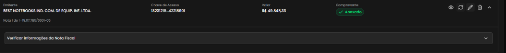
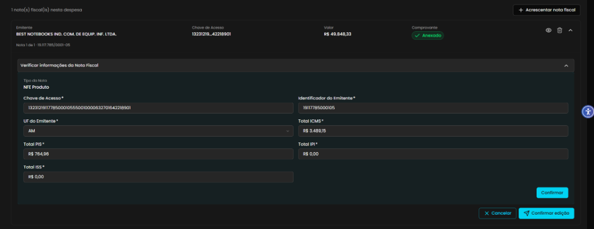

## Título
Desaparecimento da seção de itens da Nota Fiscal durante a edição de comprovante anexado

## ID
BUG-M014-FO-NF-019

## Requisito/Regra Violada
- Fluxo/Contexto: Comprovação de Débito — **Seção 2 (Verificar Informações da Nota Fiscal / Listagem e Edição de Itens da NF-e)**
- Regra Canônica: M014: `RN05` / `RN07` / `RI3` (`ItemDocumentoFiscal.ValorTotal = Quantidade × ValorUnitario` e integridade da listagem e vinculação de itens de nota fiscal)
- Heurísticas de Usabilidade de Nielsen:
  - **Heurística #1 (Visibilidade do Status do Sistema)**: O sistema oculta informações cruciais do estado do documento (itens, quantidades e valores unitários extraídos do XML) ao transitar para o modo de edição.
  - **Heurística #6 (Reconhecimento em vez de Memorização)**: O usuário é privado de visualizar ou ajustar os itens da nota fiscal na mesma interface onde edita os metadados tributários.
- Caso de Teste Relacionado: `CT-M014-FO-041` (Validar tabela de Itens da Nota Fiscal)
- Rota/Componente: `/coordenador/prestacao-financeira/detalhes/:paymentId` (`ComprovarDebito.vue` / `NotaFiscalCard.vue` / Seção `2. Adicionar Descrição e Anexar Nota Fiscal *`)

## Ambiente
[ ] Produção  [ ] Staging  [x] Homologação

## Dispositivo/SO
Windows 11 / Chrome v120 / Frontoffice Vue-Nuxt UI em `https://conectafapes.hom.es.gov.br`

## Gravidade/Prioridade
[ ] 🔴 Bloqueante  [x] 🟠 Alta  [ ] 🟡 Média  [ ] 🟢 Baixa

## Passo a Passo
1. Acessar o extrato financeiro em `/coordenador/financeira` com o perfil de Coordenador.
2. Abrir uma transação de débito que já possua uma Nota Fiscal anexada e a seção `3. Associar Compra *` visível e populada com os itens da despesa (ex.: item "Notebook Avell A52...").
3. Na seção `2. Adicionar Descrição e Anexar Nota Fiscal *`, localizar o card da nota fiscal anexada (ex.: emitente BEST NOTEBOOKS IND. COM. DE EQUIP. INF. LTDA.).
4. Clicar no botão `Editar` (ícone de lápis) no canto superior direito do card da nota fiscal.
5. Observar o conteúdo expandido no painel *"Verificar informações da Nota Fiscal"*.
6. Constatar que são exibidos apenas os campos cadastrais e tributários da nota (Tipo da Nota, Chave de Acesso, Identificador do Emitente, UF, ICMS, PIS, IPI, ISS) seguidos diretamente dos botões de ação, estando a seção/tabela de **"Itens da Nota Fiscal"** completamente ausente da tela.

## Dados de Entrada
- Rota: `/coordenador/prestacao-financeira/detalhes/:paymentId`
- Nota Fiscal Anexada: `BEST NOTEBOOKS IND. COM. DE EQUIP. INF. LTDA.` (Chave: `132312191177850001055500100000632701642218901`, Valor: `R$ 49.848,33`)
- Item Presente na Despesa (Seção 3): `Notebook Avell A52 HYB NEW I7-12650H RTX 3050...` (Valor Total: `R$ 7.121,19`)

## Comportamento Esperado
- Ao acionar a edição da Nota Fiscal já anexada, o painel *"Verificar informações da Nota Fiscal"* deve renderizar tanto os campos gerais de tributos quanto a tabela de **"Itens da Nota Fiscal"** (conforme especificado em `CT-M014-FO-041`), contendo as colunas:
  - `Descrição`
  - `Quantidade`
  - `Valor Unitário`
  - `Valor Total`
- O usuário deve ser capaz de inspecionar todos os itens da nota fiscal e acionar o modal de edição de itens para realizar correções de quantidade ou valor antes de confirmar as alterações.

## Comportamento Atual
- A tabela/seção de itens da Nota Fiscal não é renderizada dentro do card durante o modo de edição.
- A interface exibe apenas os campos de impostos e salta diretamente para os botões de ação (`Confirmar`, `Cancelar`, `Confirmar edição`), impossibilitando a visualização e manutenção dos itens pertencentes àquele documento fiscal.

## Evidências
- 📷 **Card da Nota Fiscal antes da edição (comprovante anexado):**
  
- 📷 **Painel de edição expandido sem a seção/tabela de itens da nota fiscal:**
  

## Sugestão de Investigação
- Inspecionar a estrutura do componente `NotaFiscalCard.vue` (ou componente equivalente de verificação da NFe) e analisar as diretivas `v-if` / `v-show` aplicadas no bloco `<ItensNotaFiscalTable>` ou na seção de itens.
- Verificar se a variável de estado reativo que armazena a lista de itens (`itens` / `documentoFiscal.itens`) está sendo limpa, sobrescrita ou não repassada quando o card transita para `isEditing = true`.
- Garantir que o bloco de itens da nota fiscal permaneça montado e visível tanto em modo leitura quanto em modo de edição da Nota Fiscal.
