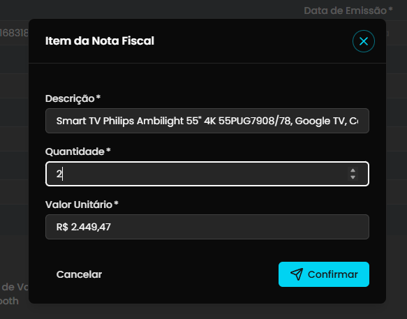
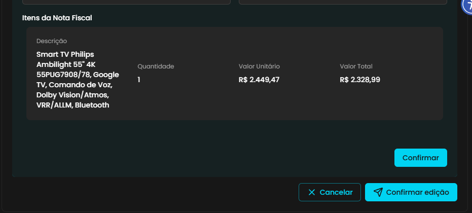

## Título
[Bug] Edição de quantidade de item da Nota Fiscal exibe toast de sucesso mas não persiste alteração após recarregar a página

## ID
BUG-M014-FO-NF-020

## Requisito/Regra Violada
- Regra Canônica:
  - M014: `RN05` (Integridade da edição de `ItemDocumentoFiscal`: quantidade, valor unitário e valor total vinculado à `JustificativaDespesa`).
  - M014: `RI3` (`ItemDocumentoFiscal.ValorTotal = Quantidade × ValorUnitario`).
  - M014: `RN09` (Auditoria e rastreabilidade das alterações nos itens da comprovação).
- Heurísticas de Usabilidade de Nielsen:
  - **Heurística #1 (Visibilidade do Status do Sistema)**: O sistema exibe um toast verde afirmativo *"Nota fiscal editada com sucesso"* e atualiza os valores temporariamente na tela, mas não persiste a alteração no servidor, transmitindo um falso estado de sucesso ao usuário.
  - **Heurística #2 (Correspondência entre o sistema e o mundo real)**: O usuário acredita ter ajustado a quantidade do item adquirido, mas ao recarregar a página ou submeter a prestação, os dados retornam ao estado anterior.
- Casos de Teste Relacionados: `CT-M014-FO-129` (editar campos de item da Nota Fiscal e validar recálculo de valor total e persistência), `CT-M014-FO-041` (validar tabela de itens da nota fiscal).
- Referência de Regressão: `BUG-M014-FO-NF-003` (Issue #545, anteriormente encerrada).
- Rota/Componente: `/coordenador/prestacao-financeira/:id` (`DetalhesPrestacao.vue` / `usePrestacaoNotaFiscalSection.ts` / modal `DetalhesPrestacaoItemModal.vue`)
- Endpoint / Contrato: `PUT /api/prestacao-de-contas/projeto/:projetoId/item/:itemId` (`ItemService.editarItemNFE`)

## Ambiente
[ ] Produção  [ ] Staging  [x] Homologação

## Dispositivo/SO
Windows 11 / Chrome / Frontoffice Vue-Nuxt UI em `https://conectafapes.hom.es.gov.br`

## Gravidade/Prioridade
[ ] 🔴 Bloqueante  [x] 🟠 Alta  [ ] 🟡 Média  [ ] 🟢 Baixa

## Passo a Passo
1. Acessar a tela de comprovação de débito com Nota Fiscal já anexada e confirmada (`/coordenador/prestacao-financeira/:id`).
2. Na seção `2. Adicionar Descrição e Anexar Nota Fiscal *`, clicar no botão `Editar` no card da Nota Fiscal para abrir o painel `Verificar Informações da Nota Fiscal`.
3. Na tabela `Itens da Nota Fiscal`, observar o item exibido (ex.: *Smart TV Philips Ambilight 55" 4K...* com Quantidade `1`, Valor Unitário `R$ 2.449,47` e Valor Total `R$ 2.328,99`).
4. Clicar sobre a linha do item para abrir o modal `Item da Nota Fiscal`.
5. No modal, alterar o campo `Quantidade *` de `1` para `2` e clicar no botão `Confirmar`.
6. No rodapé da seção, clicar em `Confirmar edição`.
7. Observar a exibição do toast verde *"Nota fiscal editada com sucesso"* e a atualização visual dos valores na tabela (Quantidade `2` e Valor Total `R$ 4.898,94`).
8. Pressionar `F5` ou recarregar a página no navegador.
9. Verificar a quantidade e o valor total do item exibidos na tabela `Itens da Nota Fiscal`.

## Dados de Entrada
- Rota: `/coordenador/prestacao-financeira/:id`
- Item Editado: `Smart TV Philips Ambilight 55" 4K 55PUG7908/78, Google TV, Comando de Voz, Dolby Vision/Atmos, VRR/ALLM, Bluetooth`
- Quantidade Original: `1`
- Valor Unitário: `R$ 2.449,47`
- Valor Total Original: `R$ 2.328,99`
- Quantidade Editada: `2`
- Valor Total Recalculado na Edição: `R$ 4.898,94`
- Quantidade Retornada após Recarregamento (`F5`): `1`
- Valor Total Retornado após Recarregamento (`F5`): `R$ 2.328,99`

## Comportamento Esperado
- Ao acionar `Confirmar edição`, a alteração da quantidade do item e o recálculo do seu valor total devem ser persistidos com sucesso no servidor.
- O toast *"Nota fiscal editada com sucesso"* deve refletir uma operação já persistida no banco de dados.
- Ao recarregar a página (`F5`), a tabela `Itens da Nota Fiscal` deve preservar os valores editados: Quantidade `2` e Valor Total `R$ 4.898,94`.

## Comportamento Atual
- O sistema exibe o toast verde *"Nota fiscal editada com sucesso"* e atualiza a interface localmente em tempo de execução.
- Contudo, a alteração **não é persistida no servidor**: ao recarregar a página (`F5`), a Quantidade retorna para `1` e o Valor Total retorna para `R$ 2.328,99`, caracterizando falso sucesso e falha de persistência.

## Evidências
- 📷 **Item na tabela antes da edição (Quantidade: 1, Valor Total: R$ 2.328,99):**  
  

- 📷 **Modal de edição com quantidade alterada para 2:**  
  

- 📷 **Toast de sucesso exibido e valores atualizados na tabela antes do reload:**  
  

- 📷 **Após recarregar a página (F5), valores voltam ao estado anterior:**  
  

## Sugestão de Investigação
- **Frontend (`usePrestacaoNotaFiscalSection.ts`):**
  - No método de confirmação de edição, a iteração de atualização dos itens é executada através de `deps.arqProcessado.value.itens.map(async (item: ItemNFEResponse) => { ... })` sem o uso de `await Promise.all(...)`.
  - Como o array de Promises não é aguardado antes de definir `editingStep1.value = false` e acionar o `toast.add`, a interface notifica sucesso instantâneo ao usuário mesmo que as requisições assíncronas `editarItem` estejam pendentes, falhem silenciosamente ou sofram rejeição.
- **Backend (`leds-conectafapes-prestacao-de-contas` / M014):**
  - Investigar o endpoint `PUT /api/prestacao-de-contas/projeto/:projetoId/item/:itemId` (`item.service.ts` / `ItemController`):
    - Verificar se o comando de atualização persiste de fato os campos `Quantidade` e `ValorTotal` da entidade `ItemDocumentoFiscal` no banco de dados.
    - Assegurar que o `DocumentoFiscal` pai também atualiza e recalcula seu somatório total de itens vinculados.
