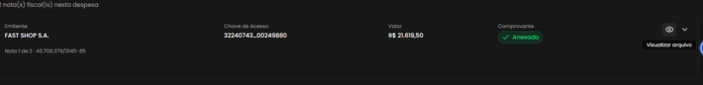
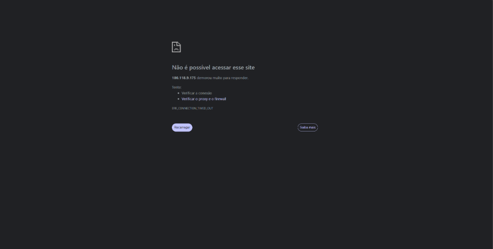

## Título
[Bug] Redirecionamento para IP interno inacessível (ERR_CONNECTION_TIMED_OUT) ao tentar visualizar anexo de Nota Fiscal

## ID
BUG-M014-FO-NF-020

## Requisito/Regra Violada
- Fluxo/Contexto: Comprovação de Débito — **Seção 2 (Adicionar Descrição e Anexar Nota Fiscal / Visualização de Arquivo Anexado)**
- Regra Canônica: M014: `RN06` / `RN07` / Comprovação de despesa com documento fiscal válido e garantia de acesso e conferência de documentos anexados pelo Coordenador
- Heurísticas de Usabilidade de Nielsen:
  - **Heurística #1 (Visibilidade do Status do Sistema)**: O sistema tenta direcionar o usuário para um IP de infraestrutura interna/privada sem DNS ou rota pública, não fornecendo feedback na interface e resultando em tela de falha de conexão do navegador.
  - **Heurística #9 (Ajudar usuários a reconhecer, diagnosticar e recuperar-se de erros)**: Ação do usuário resulta em crash/queda de conexão com erro de rede (`ERR_CONNECTION_TIMED_OUT`) sem mecanismo de recuperação ou mensagem amigável da aplicação.
- Rota/Componente: `/coordenador/prestacao-financeira/detalhes/:paymentId` (`ComprovarDebito.vue` / `NotaFiscalCard.vue` / Botão `Visualizar arquivo`)

## Ambiente
[ ] Produção  [ ] Staging  [x] Homologação

## Dispositivo/SO
Windows 11 / Chrome v120 / Frontoffice Vue-Nuxt UI em `https://conectafapes.hom.es.gov.br`

## Gravidade/Prioridade
[ ] 🔴 Bloqueante  [x] 🟠 Alta  [ ] 🟡 Média  [ ] 🟢 Baixa

## Passo a Passo
1. Acessar o sistema com perfil de Coordenador e navegar até o extrato em `/coordenador/financeira`.
2. Acessar a comprovação de uma transação de débito em `/coordenador/prestacao-financeira/detalhes/:paymentId`.
3. Na seção `2. Adicionar Descrição e Anexar Nota Fiscal *`, realizar o anexo ou localizar um card de Nota Fiscal com status `Comprovante: Anexado`.
4. No card da Nota Fiscal (ex.: emitente `FAST SHOP S.A.`), clicar no botão com ícone de olho (`Visualizar arquivo`).
5. Observar o redirecionamento para uma nova aba no navegador.
6. Constatar que a nova aba tenta se conectar a um IP interno (`100.118.9.175`), entra em espera por tempo indeterminado e exibe a mensagem de erro do navegador *"Não é possível acessar esse site - 100.118.9.175 demorou muito para responder (ERR_CONNECTION_TIMED_OUT)"*, impedindo a visualização do arquivo da Nota Fiscal.

## Dados de Entrada
- Rota: `/coordenador/prestacao-financeira/detalhes/:paymentId`
- Seção: `2. Adicionar Descrição e Anexar Nota Fiscal *`
- Emitente: `FAST SHOP S.A.` (CNPJ: `43.708.379/0145-85`)
- Chave de Acesso: `32240743...00249880`
- Valor: `R$ 21.619,50`
- Status do Comprovante: `Anexado`
- Ação disparada: Clique no botão `Visualizar arquivo` (ícone de olho)
- Endereço de destino disparado: `http://100.118.9.175/...` (IP de rede interna / Tailscale CGNAT)
- Erro no navegador: `ERR_CONNECTION_TIMED_OUT`

## Comportamento Esperado
- Ao clicar no botão `Visualizar arquivo`, o sistema deve abrir a URL pública assinada (`presigned-url`) acessível pela internet ou abrir o leitor/modal de visualização de arquivos do sistema, exibindo o PDF/imagem da Nota Fiscal anexada para conferência imediata do usuário.

## Comportamento Atual
- A aplicação redireciona o usuário para um IP interno/privado inacessível externamente (`100.118.9.175`). O navegador não consegue estabelecer conexão, resultando em erro `ERR_CONNECTION_TIMED_OUT` ("Não é possível acessar esse site") e deixando o usuário completamente impossibilitado de inspecionar a Nota Fiscal anexada.

## Evidências
- 📷 **Card da Nota Fiscal anexada com botão de ação 'Visualizar arquivo':**
  
- 📷 **Redirecionamento para IP interno 100.118.9.175 com falha de conexão (ERR_CONNECTION_TIMED_OUT):**
  

## Sugestão de Investigação
- Inspecionar a configuração do endpoint de geração de URLs assinadas / download de arquivos de comprovante no serviço de storage (MinIO / S3).
- O backend está retornando presigned URLs baseadas no endpoint interno da infraestrutura (`100.118.9.175`, faixa Tailscale) em vez do hostname público do serviço de storage (ex.: `storage.conectafapes.hom.es.gov.br` ou via rota de proxy da própria API do Conecta FAPES).
- Ajustar as variáveis de ambiente do serviço de arquivos (ex.: `S3_PUBLIC_ENDPOINT`, `MINIO_BROWSER_REDIRECT_URL` ou equivalente) para garantir que as URLs geradas para o cliente web usem o domínio externo roteável.
