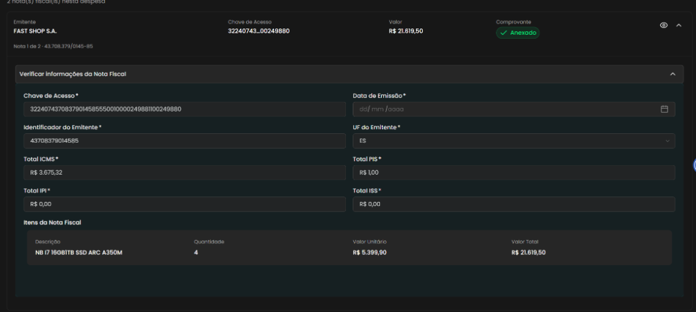

## Título
[Bug] Campo obrigatório 'Data de Emissão' permanece vazio após anexar Nota Fiscal na Seção 2

## ID
BUG-M014-FO-NF-021

## Requisito/Regra Violada
- Fluxo/Contexto: Comprovação de Débito — **Seção 2 (Adicionar Descrição e Anexar Nota Fiscal / Verificar Informações da Nota Fiscal)**
- Regra Canônica: M014: `RN06` / `RN07` / Invariantes de documentos fiscais e extração automatizada de metadados da NF-e a partir do XML (`<dhEmi>` / `<dEmi>`)
- Heurísticas de Usabilidade de Nielsen:
  - **Heurística #1 (Visibilidade do Status do Sistema)**: O sistema extrai com sucesso chave de acesso, CNPJ do emitente, UF, tributos e itens da compra, mas omite a Data de Emissão, deixando o campo obrigatório em branco sem justificativa visível.
  - **Heurística #5 (Prevenção de Erros)**: Sendo um campo com asterisco de obrigatoriedade (`*`), a ausência do valor extraído obriga o usuário a intervenção manual ou pode gerar erros de validação na confirmação do documento.
- Caso de Teste Relacionado: `CT-M014-FO-040` (Verificar informações extraídas da NFe) / `CT-M014-FO-112` (Validar omissão da data de emissão ao recarregar a página)
- Rota/Componente: `/coordenador/prestacao-financeira/detalhes/:paymentId` (`ComprovarDebito.vue` / `NotaFiscalCard.vue` / Campo `Data de Emissão *`)

## Ambiente
[ ] Produção  [x] Staging  [ ] Homologação

## Dispositivo/SO
Windows 11 / Chrome v120 / Frontoffice Vue-Nuxt UI em `https://stage.conectafapes.leds.dev.br`

## Gravidade/Prioridade
[ ] 🔴 Bloqueante  [ ] 🟠 Alta  [x] 🟡 Média  [ ] 🟢 Baixa

## Passo a Passo
1. Acessar o sistema com perfil de Coordenador no ambiente de Staging (`https://stage.conectafapes.leds.dev.br`).
2. Navegar até o extrato em `/coordenador/financeira` e abrir a tela de comprovação de uma transação de débito em `/coordenador/prestacao-financeira/detalhes/:paymentId`.
3. Na seção `2. Adicionar Descrição e Anexar Nota Fiscal *`, anexar um arquivo XML/PDF de Nota Fiscal eletrônica válida.
4. Expandir o painel *"Verificar Informações da Nota Fiscal"* no card da nota fiscal anexada.
5. Inspecionar o preenchimento dos campos extraídos do documento fiscal.
6. Constatar que os campos `Chave de Acesso`, `Identificador do Emitente`, `UF do Emitente`, `Total ICMS`, `Total PIS`, `Total IPI`, `Total ISS` e a tabela de `Itens da Nota Fiscal` foram extraídos e preenchidos, porém o campo obrigatório `Data de Emissão *` permanece vazio exibindo apenas a máscara `dd/ mm /aaaa`.

## Dados de Entrada
- Rota: `/coordenador/prestacao-financeira/detalhes/:paymentId`
- Seção: `2. Adicionar Descrição e Anexar Nota Fiscal *`
- Painel: `Verificar Informações da Nota Fiscal`
- Emitente: `FAST SHOP S.A.` (CNPJ: `43.708.379/0145-85`)
- Chave de Acesso: `32240743708379014585550010000249881100249880`
- Valor Total da Nota: `R$ 21.619,50`
- Campo afetado: `Data de Emissão *` (Valor exibido: `dd/ mm /aaaa`)

## Comportamento Esperado
- Ao realizar o upload e extração de dados da Nota Fiscal, o sistema deve ler a data de emissão contida nas tags do documento fiscal (`<dhEmi>` / `<dEmi>` no XML da NF-e) e preencher automaticamente o campo `Data de Emissão *` formatado no padrão `DD/MM/AAAA`.

## Comportamento Atual
- O campo obrigatório `Data de Emissão *` não é preenchido pela extração e permanece em branco (`dd/ mm /aaaa`), mesmo com todos os outros metadados cadastrais, tributários e itens extraídos com sucesso.

## Evidências
- 📷 **Painel de informações da Nota Fiscal com o campo obrigatório 'Data de Emissão *' vazio:**
  

## Sugestão de Investigação
- Inspecionar o parser/serviço responsável pela leitura do XML da NF-e (endpoint de upload ou composable de extração).
- Verificar se o campo `dhEmi` / `dEmi` está sendo capturado e repassado no payload de resposta para o frontend com a chave esperada (`dataEmissao` / `issueDate`).
- Verificar se o componente `NotaFiscalCard.vue` realiza o binding reativo do modelo de data (`v-model="dataEmissao"`) com o formato exigido pelo componente de input com máscara/calendário.
