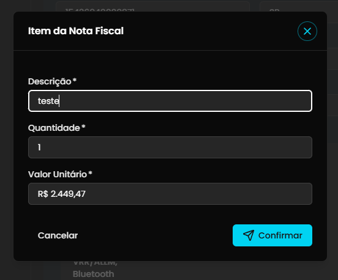

## Título
[Bug] Edição de descrição de item da Nota Fiscal exibe sucesso mas não persiste após recarregar a página

## ID
BUG-M014-FO-NF-021

## Requisito/Regra Violada
- Fluxo/Contexto: Comprovação de Débito — **Seção 2 (Verificar Informações da Nota Fiscal / Listagem e Edição de Itens da NF-e)**
- Regra Canônica:
  - M014: `RN05` (Integridade da edição de `ItemDocumentoFiscal` vinculado à `JustificativaDespesa` / `DocumentoFiscal`).
  - M014: `RN09` (Rastreabilidade e integridade das alterações nos dados de comprovação da despesa).
- Heurísticas de Usabilidade de Nielsen:
  - **Heurística #1 (Visibilidade do Status do Sistema)**: O sistema exibe um toast afirmativo de sucesso *"Nota fiscal editada com sucesso"* e reflete a nova descrição na tabela localmente, transmitindo a ilusão de que a alteração foi gravada, quando na verdade não houve persistência no servidor.
- Rota/Componente: `/coordenador/prestacao-financeira/detalhes/:paymentId` (`DetalhesPrestacaoNotaFiscalSection.vue` / `usePrestacaoNotaFiscalSection.ts` — Modal `Item da Nota Fiscal`)
- Contrato/API: `PUT /prestacao-de-contas/projeto/:projetoId/item-documento-fiscal/:itemId` (`itemService.editarItemNFE`)

## Ambiente
[ ] Produção  [ ] Staging  [x] Homologação

## Dispositivo/SO
Windows 11 / Chrome / Frontoffice Vue-Nuxt UI em `https://conectafapes.hom.es.gov.br`

## Gravidade/Prioridade
[ ] 🔴 Bloqueante  [x] 🟠 Alta  [ ] 🟡 Média  [ ] 🟢 Baixa

## Passo a Passo

> **Pré-condição:** Estar autenticado como Coordenador e acessar uma transação de débito com Nota Fiscal eletrônica previamente anexada e confirmada.

1. Acessar `https://conectafapes.hom.es.gov.br/prestacao-financeira/:paymentId` em uma transação com Nota Fiscal confirmada.
2. Na seção de dados da Nota Fiscal (`Verificar Informações da Nota Fiscal`), acionar a ação de editar a nota fiscal.
3. Na tabela `Itens da Nota Fiscal`, clicar no card de um item cadastrado para abrir o modal `Item da Nota Fiscal`.
4. No campo obrigatório `Descrição *`, alterar o texto da descrição (ex.: de `Smart TV Philips Ambilight 55" 4K 55PUG7908/78, Google TV, Comando de Voz, Dolby Vision/Atmos, VRR/ALLM, Bluetooth` para `teste`).
5. Clicar no botão `Confirmar` no rodapé do modal.
6. Clicar no botão de confirmação da edição da nota fiscal na seção principal (`Confirmar edição`).
7. Observar o toast verde de confirmação: *"Nota fiscal editada com sucesso"*.
8. Recarregar a página no navegador (`F5`).
9. Verificar a descrição do item na tabela `Itens da Nota Fiscal`.

## Dados de Entrada
- Rota: `/coordenador/prestacao-financeira/detalhes/:paymentId`
- Item original da Nota Fiscal:
  - Descrição: `Smart TV Philips Ambilight 55" 4K 55PUG7908/78, Google TV, Comando de Voz, Dolby Vision/Atmos, VRR/ALLM, Bluetooth`
  - Quantidade: `1`
  - Valor Unitário: `R$ 2.449,47`
  - Valor Total: `R$ 2.328,99`
- Edição realizada no modal:
  - Descrição alterada para: `teste`
  - Quantidade: `1`
  - Valor Unitário: `R$ 2.449,47`

## Comportamento Esperado
- Ao confirmar a edição do item no modal e submeter a edição da Nota Fiscal, o sistema deve enviar e persistir no backend o novo valor do campo `Descrição` (`teste`) para a entidade `ItemDocumentoFiscal`.
- O toast *"Nota fiscal editada com sucesso"* deve ser emitido somente após a resolução e confirmação bem-sucedida das requisições de persistência no servidor.
- Ao recarregar a página (`F5`), a tabela `Itens da Nota Fiscal` e a seção subsequente `Associar Compra` devem exibir o item com a descrição atualizada (`teste`).

## Comportamento Atual
- O toast *"Nota fiscal editada com sucesso"* é exibido e a tabela `Itens da Nota Fiscal` atualiza a descrição para `teste` temporariamente apenas no estado reativo local em memória da tela.
- A seção subsequente `Associar Compra *` não é sincronizada, mantendo a descrição original da TV.
- Ao recarregar a página (`F5`), a descrição do item reverte imediatamente para o valor original (`Smart TV Philips Ambilight 55" 4K 55PUG7908/78, Google TV, Comando de Voz, Dolby Vision/Atmos, VRR/ALLM, Bluetooth`), confirmando que a alteração da descrição **não foi persistida** no banco de dados.

## Evidências
- 📷 Screenshots / Vídeos:
  - 
- 🧾 Retorno: Toast de sucesso exibido (`Nota fiscal editada com sucesso`), porém com dessincronização imediata na seção `Associar Compra` e reversão completa do dado após recarregar a página (`F5`).

## Sugestão de Investigação
- Em `src/modules/PrestacaoContas/composables/usePrestacaoNotaFiscalSection.ts` (linhas 622-636), a chamada de atualização dos itens é executada dentro de `deps.arqProcessado.value.itens.map(async (item) => ...)` sem `await Promise.all(...)`. Por se tratar de um `.map` com callback assíncrono não aguardado, as Promises ficam soltas em background e a função dispara imediatamente o toast de sucesso e finaliza a edição, ocultando eventuais falhas assíncronas de rede ou de validação da API.
- Verificar se a chamada `PUT prestacao-de-contas/projeto/:projetoId/item-documento-fiscal/:itemId` (`itemService.editarItemNFE`) é disparada corretamente e se a API backend aceita e persiste a propriedade `descricao` de `ItemNFEResponse`, ou se há rejeição/descarte desse campo no modelo de persistência de `ItemDocumentoFiscal`.
