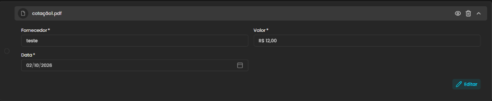
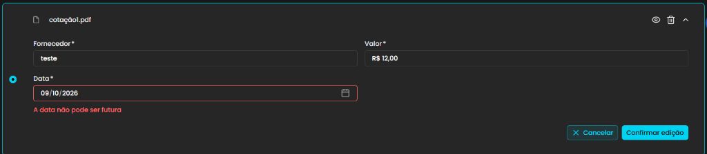
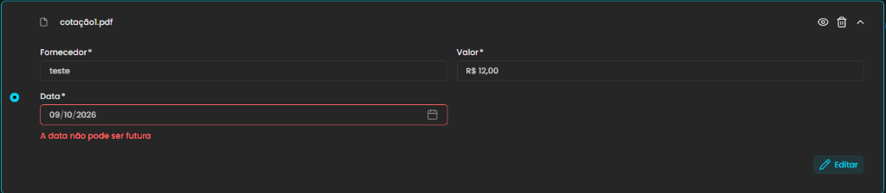

## Título
[Bug] Cancelar edição de cotação mantém alterações e mensagem de erro visual em vez de restaurar valores originais

## ID
BUG-M014-FO-NF-022

## Requisito/Regra Violada
- Fluxo/Contexto: Comprovação de Débito — **Seção 4 (Cotação / Orçamento de Fornecedor)**
- Regra Canônica:
  - M014: `RN05` (Comprovação por orçamentos de fornecedor e integridade dos registros de cotação).
  - M014: `RN09` (Auditoria e rastreabilidade dos dados informados na prestação).
- Heurísticas de Usabilidade de Nielsen:
  - **Heurística #3 (Controle e Liberdade do Usuário)**: A ação de cancelar uma operação deve atuar como uma saída de emergência clara e previsível, descartando qualquer modificação não confirmada e revertendo o estado do formulário para os valores previamente salvos.
  - **Heurística #1 (Visibilidade do Status do Sistema)**: O sistema transita o card para o modo de leitura/visualização (exibindo o botão `Editar`), mas mantém ativo o texto de erro de validação em vermelho (*"A data não pode ser futura"*), apresentando um estado de interface inconsistente e enganoso.
- Rota/Componente: `/coordenador/prestacao-financeira/detalhes/:paymentId` (`DetalhesPrestacaoCotacaoCard.vue` / `useCotacaoCard.ts` — função `cancelEditCotacao`)
- Endpoint / Entidade: `OrcamentoFornecedor`

## Ambiente
[ ] Produção  [ ] Staging  [x] Homologação

## Dispositivo/SO
Windows 11 / Chrome / Frontoffice Vue-Nuxt UI em `https://conectafapes.hom.es.gov.br`

## Gravidade/Prioridade
[ ] 🔴 Bloqueante  [ ] 🟠 Alta  [x] 🟡 Média  [ ] 🟢 Baixa

## Passo a Passo

> **Pré-condição:** Estar autenticado como Coordenador e acessar uma transação de débito com a seção `4. Cotação` visível e ao menos um orçamento/cotação previamente salvo.

1. Acessar `https://conectafapes.hom.es.gov.br/prestacao-financeira/:paymentId`.
2. Rolar a página até a seção `4. Cotação`.
3. Localizar o card do orçamento salvo (ex.: `cotação1.pdf` com Fornecedor `teste`, Valor `R$ 12,00` e Data `02/10/2026`).
4. Clicar no botão `Editar` (ícone de lápis) no canto inferior direito do card.
5. Alterar o campo `Data *` para uma data futura (ex.: `09/10/2026`).
6. Observar o disparo da validação com a mensagem em vermelho: *"A data não pode ser futura"*.
7. Clicar no botão `Cancelar` no rodapé do card para desistir da edição.
8. Observar o estado visual do card após o fechamento do modo de edição.

## Dados de Entrada
- Rota: `/coordenador/prestacao-financeira/detalhes/:paymentId`
- Cotação original salva:
  - Arquivo: `cotação1.pdf`
  - Fornecedor: `teste`
  - Valor: `R$ 12,00`
  - Data: `02/10/2026`
- Alteração temporária no modo de edição:
  - Campo `Data *` alterado para: `09/10/2026`
  - Erro disparado: *"A data não pode ser futura"*
- Ação disparadora: Clicar em `Cancelar`

## Comportamento Esperado
- Ao clicar em `Cancelar`, o sistema deve descartar completamente as alterações temporárias feitas pelo usuário.
- O campo `Data *` deve retornar imediatamente para o valor original (`02/10/2026`).
- O estado de validação do formulário deve ser resetado, limpando a mensagem de erro em vermelho (*"A data não pode ser futura"*).
- O card deve retornar ao modo de visualização limpo com o botão `Editar`, refletindo com fidelidade que nenhuma alteração foi gravada.

## Comportamento Atual
- O botão `Cancelar` encerra o modo de edição e reexibe o botão `Editar`, porém **não restaura os valores originais nem limpa os erros de validação**:
  - O campo `Data *` permanece exibindo a data inválida descartada (`09/10/2026`).
  - A mensagem de erro em vermelho (*"A data não pode ser futura"*) continua visível abaixo do campo, mesmo estando os campos bloqueados.
- A interface transmite a falsa impressão de que a alteração (inclusive inválida) foi aceita ou que o formulário está permanentemente corrompido.

## Evidências
- 📷 Screenshots / Vídeos:
  - 
  - 
  - 
- 🧾 Retorno: Ausência de reset do estado do formulário (`resetForm`) e persistência de mensagens de validação em campos desabilitados.

## Sugestão de Investigação
- No composable `src/modules/PrestacaoContas/composables/useCotacaoCard.ts`, a função `cancelEditCotacao(index)` apenas altera as flags `editing = false` e `disable = true` e tenta atribuir valores diretamente nos campos sem acionar o ciclo de reset do Vee-Validate:
  - É necessário invocar `cotacoesObjects.value[index].form.form.resetForm()` ou `cotacoesObjects.value[index].form.form.setErrors({})` para limpar os erros residuais.
  - Garantir que a reatribuição dos valores originais de `cotacao.data`, `cotacao.fornecedor` e `cotacao.valor` utilize o método canônico de atualização de valores do Vee-Validate (`setValues` / `resetForm`), garantindo que o `v-model` reflita a data salva e não o input cancelado.
