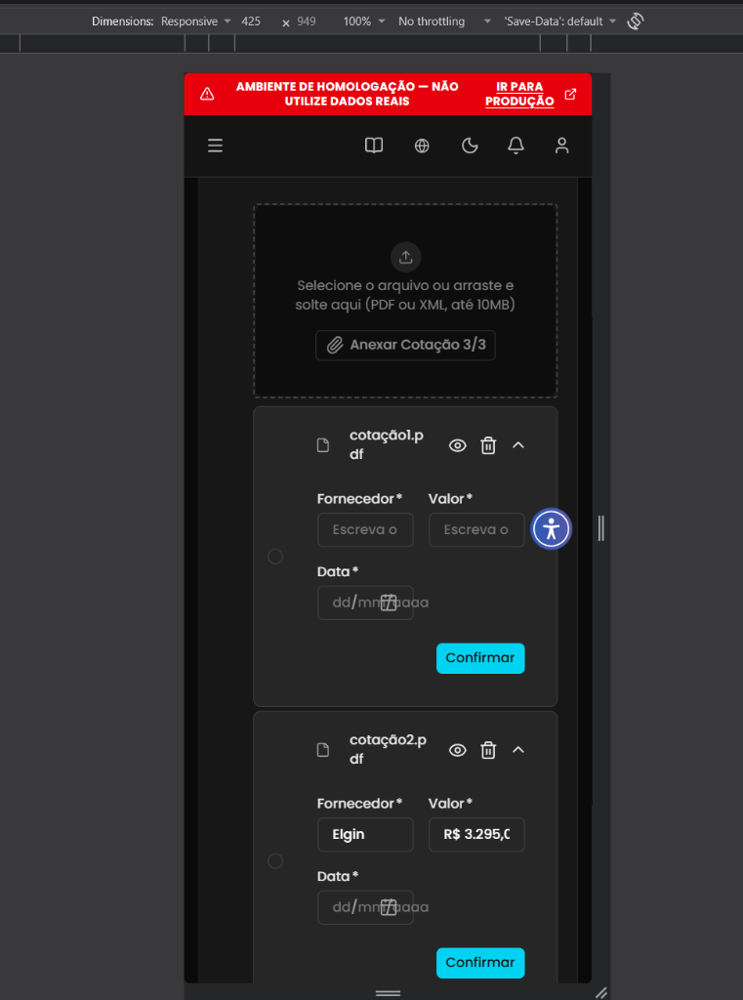
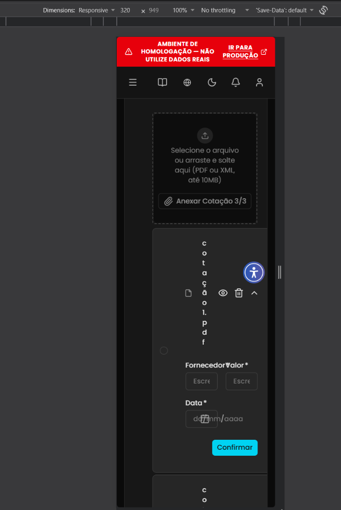

## Título
[Bug] Falha de responsividade e sobreposição de campos nos cards da Seção 4 (Cotação) em resoluções mobile abaixo de 425px

## ID
BUG-M014-FO-NF-023

## Requisito/Regra Violada
- Fluxo/Contexto: Comprovação de Débito — **Seção 4 (Cotação / Orçamento de Fornecedores)**
- Regra Canônica: M014: `RN05` (Cada justificativa de despesa pode ter até 3 `OrcamentoFornecedor` quando o valor total ultrapassar 300 VRTE / R$ 1.400,00) / Padrão de Design Responsivo e Diretrizes Mobile-First do Frontoffice
- Heurísticas de Usabilidade de Nielsen:
  - **Heurística #4 (Consistência e Padrões)**: Falha de adaptação responsiva aos padrões de visualização em dispositivos móveis (Mobile-First / larguras de viewport de 425px a 320px).
  - **Heurística #8 (Design Estético e Minimalista)**: Elementos visuais sobrepostos (rótulos `Fornecedor*` e `Valor*` colidindo no texto ilegível `FornecedorValor *`), quebra vertical monocaractere no nome do arquivo anexado (`c-o-t-a-ç-ã-o-1-.-p-d-f`), inputs espremidos horizontalmente gerando truncamento severo de texto (`Escr` em vez de `Escreva o...`) e sobreposição do ícone de calendário com o placeholder `dd/mm/aaaa`.
  - **Heurística #7 (Flexibilidade e Eficiência de Uso)**: Inviabiliza a leitura confortável e o preenchimento dos dados de cotação em smartphones, prejudicando o uso por coordenadores em dispositivos móveis.
- Casos de Teste Relacionados:
  - `CT-M014-FO-045` (Anexar e confirmar três cotações)
  - `CT-M014-FO-046` (Selecionar cotação de menor valor)
  - `CT-M014-FO-105` (Submeter e confirmar envio de cotações de fornecedores)
  - `CT-M014-FO-106` (Validar exclusão de cotação anexada)
- Rota/Componente: `/coordenador/prestacao-financeira/detalhes/:paymentId` (`ComprovarDebito.vue` / Cards da Seção `4. Cotação`)

## Ambiente
[ ] Produção  [ ] Staging  [x] Homologação

## Dispositivo/SO
Mobile Viewport (Responsive 425px × 949px e 320px × 949px) / Chrome DevTools Mobile Emulation / Frontoffice Vue-Nuxt UI em Homologação

## Gravidade/Prioridade
[ ] 🔴 Bloqueante  [ ] 🟠 Alta  [x] 🟡 Média  [ ] 🟢 Baixa

## Passo a Passo
1. Acessar a aplicação Frontoffice com perfil de Coordenador no Ambiente de Homologação.
2. Acessar os detalhes de uma transação de débito sujeita à cotação (valor acima de 300 VRTE / R$ 1.400,00) na rota `/coordenador/prestacao-financeira/detalhes/:paymentId`.
3. Abrir as Ferramentas de Desenvolvedor (`F12`) e ativar a emulação de dispositivos móveis (Device Mode), definindo a largura da viewport para `<= 425px` (ex.: `425px` e `320px` - padrão Mobile Small / iPhone SE).
4. Rolar a página até a seção `4. Cotação`.
5. Anexar um ou mais arquivos de cotação (ex.: `cotação1.pdf`, `cotação2.pdf`).
6. Observar a disposição visual e renderização dos cards de cotação, rótulos, campos de entrada (`Fornecedor`, `Valor`, `Data`), ícones e nome do arquivo.

## Dados de Entrada
- Rota: `/coordenador/prestacao-financeira/detalhes/:paymentId`
- Seção: `4. Cotação`
- Arquivos anexados: `cotação1.pdf`, `cotação2.pdf`
- Resoluções testadas:
  - `425px × 949px` (Mobile Large)
  - `320px × 949px` (Mobile Small - iPhone SE)

## Comportamento Esperado
- Em dispositivos móveis ou resoluções abaixo de 425px, os cards da Seção 4 (Cotação) devem ser responsivos:
  - O cabeçalho do card deve truncar adequadamente o nome do arquivo longo ou permitir quebra fluida sem isolar letras unitárias.
  - O grid ou flex dos campos de formulário deve empilhar verticalmente em coluna única (`grid-template-columns: 1fr` ou `flex-direction: column` em breakpoints mobile `@media (max-width: 640px)` / `<= 425px`), garantindo largura e legibilidade para os campos `Fornecedor *`, `Valor *` e `Data *`.
  - Os rótulos não devem colidir nem sobrepor texto.
  - O radio button de seleção e os botões de ação devem ficar devidamente contidos e alinhados dentro da estrutura do card.

## Comportamento Atual
- A seção 4 não possui adaptação responsiva adequada para resoluções mobile abaixo de 425px:
  - **Em 425px**: O nome do arquivo quebra de forma inadequada (`cotação1.p` / `df`), os campos `Fornecedor *` e `Valor *` ficam comprimidos lado a lado em colunas excessivamente estreitas, truncando os placeholders para `"Escreva o"` e encurtando os valores digitados. O radio button de seleção fica deslocado para a margem externa esquerda.
  - **Em 320px (Mobile Small / iPhone SE)**: Colapso severo de layout:
    - O nome do arquivo sofre quebra caractere por caractere, formando uma coluna vertical de uma única letra (`c`, `o`, `t`, `a`, `ç`, `ã`, `o`, `1`, `.`, `p`, `d`, `f`), empurrando os ícones de ação.
    - Os rótulos `Fornecedor*` e `Valor*` colidem e sobrepõem-se diretamente no mesmo espaço visual, gerando o texto ilegível `FornecedorValor *`.
    - Os inputs de entrada são esmagados horizontalmente, reduzindo os placeholders para apenas 4 caracteres (`Escr`).
    - O campo de data `Data *` sobrepõe o texto de máscara `dd/mm/aaaa` diretamente sobre o ícone de calendário.

## Evidências
- 📷 **Card de Cotação em resolução Mobile 425px (campos espremidos e truncados):**
  

- 📷 **Colapso severo de layout em resolução Mobile 320px (rótulos sobrepostos, inputs comprimidos e quebra vertical monocaractere):**
  

## Sugestão de Investigação
- Inspecionar o componente que renderiza os cards de cotação na Seção 4 (ex.: `CotacaoCard.vue` ou seção de cotação em `ComprovarDebito.vue`):
  - No grid dos campos `Fornecedor` e `Valor`, substituir o layout fixo de duas colunas (`grid grid-cols-2` ou similar) por um padrão responsivo (`grid grid-cols-1 sm:grid-cols-2`), permitindo que os campos fiquem empilhados verticalmente em telas menores que `640px` / `425px`.
  - No contêiner do nome do arquivo (`cotação1.pdf`), aplicar `min-width: 0` e classes de truncamento (`truncate` / `text-overflow: ellipsis; white-space: nowrap; overflow: hidden`) para evitar que a flexbox encolha o elemento forçando o navegador a quebrar letra por letra (`word-break: break-all`).
  - Ajustar o posicionamento do radio button de seleção e espaçamentos internos (`padding` / `margin`) para garantir que o elemento não transpasse os limites do card em viewports estreitas.
