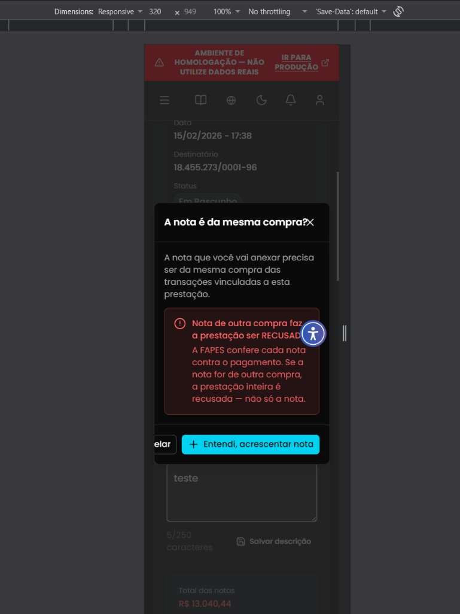

## Título
[Bug] Falha de responsividade e corte do botão Cancelar no modal de confirmação de nova Nota Fiscal em 320px

## ID
BUG-M014-FO-NF-025

## Requisito/Regra Violada
- Fluxo/Contexto: Comprovação de Débito — **Seção 2 (Adicionar Descrição e Anexar Nota Fiscal / Modal "A nota é da mesma compra?")**
- Regra Canônica: M014: `RN06` / `RN07` / Padrão de Design Responsivo e Diretrizes Mobile-First do Frontoffice (Critérios WCAG 1.4.10 - Reflow e 2.5.5 - Touch Target)
- Heurísticas de Usabilidade de Nielsen:
  - **Heurística #4 (Consistência e Padrões)**: Falha de adaptação responsiva de componente modal em viewports compactas (320px - Mobile Small / iPhone SE).
  - **Heurística #8 (Design Estético e Minimalista)**: Elementos visuais cortados e colidindo: a barra de botões no rodapé não permite quebra de linha (`flex-wrap`), fazendo o botão secundário `Cancelar` ser empurrado para a margem esquerda e cortado pela borda, exibindo apenas o fragmento `"elar"`. No cabeçalho, o botão de fechar (`✕`) colide diretamente com o texto do título (`"A nota é da mesma compra?✕"`).
  - **Heurística #3 (Controle do Usuário e Liberdade)**: Ao cortar e quase ocultar o botão `"Cancelar"`, o sistema dificulta que o coordenador desista ou feche o modal pelo botão de escape no mobile.
- Casos de Teste Relacionados:
  - `CT-M014-FO-010` (Validar envio e exibição de nota fiscal)
  - `CT-M014-FO-023` (Validar responsividade mobile da prestação financeira)
  - `CT-M014-FO-040` (Verificar informações extraídas da NFe)
- Rota/Componente: `/coordenador/prestacao-financeira/detalhes/:paymentId` (`ComprovarDebito.vue` / Modal de confirmação ao adicionar nova Nota Fiscal)

## Ambiente
[ ] Produção  [ ] Staging  [x] Homologação

## Dispositivo/SO
Mobile Viewport (Responsive 320px × 949px) / Chrome DevTools Mobile Emulation / Frontoffice Vue-Nuxt UI em Homologação

## Gravidade/Prioridade
[ ] 🔴 Bloqueante  [ ] 🟠 Alta  [x] 🟡 Média  [ ] 🟢 Baixa

## Passo a Passo
1. Acessar a aplicação Frontoffice com perfil de Coordenador no Ambiente de Homologação.
2. Navegar até o extrato em `/coordenador/financeira` e abrir a tela de comprovação de uma transação de débito em `/coordenador/prestacao-financeira/detalhes/:paymentId`.
3. Abrir as Ferramentas de Desenvolvedor (`F12`) e ativar a emulação de dispositivos móveis com largura de viewport de `320px` (ex.: `320px × 949px` - iPhone SE).
4. Na seção `2. Adicionar Descrição e Anexar Nota Fiscal *`, acionar a opção para adicionar/acrescentar uma nova nota fiscal.
5. Observar a abertura do modal de aviso/confirmação *"A nota é da mesma compra?"*.
6. Inspecionar o cabeçalho, corpo e botões de ação no rodapé do modal.

## Dados de Entrada
- Rota: `/coordenador/prestacao-financeira/detalhes/:paymentId`
- Seção: `2. Adicionar Descrição e Anexar Nota Fiscal *`
- Modal acionado: Confirmação de mesma compra (*"A nota é da mesma compra?"*)
- Resolução testada: `320px × 949px` (Mobile Small)

## Comportamento Esperado
- Em resoluções mobile de 320px, o modal deve ser totalmente responsivo:
  - No cabeçalho, o ícone de fechar (`✕`) deve possuir espaçamento e alinhamento independente em relação ao texto do título (`justify-between`), sem colidir com a pontuação.
  - No rodapé, os botões de ação (`Cancelar` e `+ Entendi, acrescentar nota`) devem empilhar verticalmente em coluna única (`flex-direction: column-reverse` / `flex-col-reverse w-full`), garantindo visibilidade total, touch targets adequados e sem transbordamento ou corte de texto na tela.

## Comportamento Atual
- O modal não se adapta à largura de 320px:
  - Os botões de ação permanecem lado a lado em linha (`flex-row`), fazendo com que o conjunto ultrapasse a largura útil do contêiner.
  - O botão `Cancelar` é empurrado para fora da margem esquerda do modal, sofrendo corte visual drástico e exibindo apenas as letras `"elar"`.
  - O ícone de fechar (`✕`) no cabeçalho encosta diretamente na interrogação do título (`"compra?✕"`), sem espaçamento.

## Evidências
- 📷 **Modal 'A nota é da mesma compra?' em resolução 320px com botão 'Cancelar' cortado e ícone de fechar colado ao título:**
  

## Sugestão de Investigação
- Inspecionar o componente do modal de confirmação de mesma compra (ex.: `ModalConfirmacaoMesmaCompra.vue` ou modal declarado em `ComprovarDebito.vue`):
  - No rodapé do modal (`footer`), aplicar layout flexível responsivo: `flex flex-col-reverse sm:flex-row justify-end gap-2`, fazendo com que em resoluções mobile (`< 425px` ou `<= 320px`) os botões empilhem verticalmente com largura total (`w-full`).
  - No cabeçalho (`header`), certificar que o título e o botão de fechar utilizem `flex justify-between items-start gap-4` para manter o ícone `✕` separado do texto.
  - Assegurar que o contêiner do modal utilize `max-w-[calc(100vw-32px)]` e `overflow-hidden` para prevenir qualquer vazamento lateral de elementos filhos.
