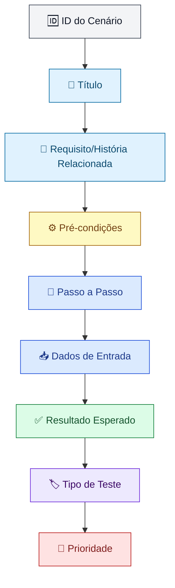

# 🧩 Criação dos Cenários de Testes

Este documento define a estrutura utilizada para a criação dos cenários (casos) de teste neste projeto, garantindo cobertura adequada dos requisitos e clareza na execução.

---

## 📐 Estrutura do Cenário de Teste



---

## 🔎 Campos do Cenário de Teste

### 1. ID do Cenário
Identificador único do caso de teste, útil para rastreabilidade em ferramentas de gestão.
> Exemplo: `CT-014`

### 2. Título
Nome curto e objetivo que resume o que está sendo validado.
> Exemplo: *"Login com credenciais inválidas"*

### 3. Requisito/História Relacionada
Vínculo com o requisito, história de usuário ou critério de aceite que originou o cenário — garante rastreabilidade entre o que foi documentado e o que está sendo testado.
> Exemplo: `US-032 - Autenticação de usuário`

### 4. Pré-condições
Situações ou configurações necessárias antes da execução do teste.
> Exemplo: *"Usuário cadastrado no sistema e deslogado da aplicação."*

### 5. Passo a Passo
Sequência exata de ações necessárias para executar o cenário.
```text
1. Acessar a tela de login
2. Inserir e-mail válido e senha incorreta
3. Clicar em "Entrar"
```

### 6. Dados de Entrada
Valores específicos utilizados na execução (massa de dados), possibilitando reprodutibilidade.
> Exemplo: *E-mail: usuario@teste.com | Senha: senhaErrada123*

### 7. Resultado Esperado
Comportamento que o sistema deve apresentar caso esteja funcionando corretamente.
> Exemplo: *"Sistema exibe a mensagem 'E-mail ou senha inválidos' e permanece na tela de login."*

### 8. Tipo de Teste
Classificação do cenário quanto à natureza da validação.
| Tipo | Descrição |
|---|---|
| Positivo | Valida o fluxo correto/esperado pelo sistema |
| Negativo | Valida o comportamento diante de entradas inválidas ou inesperadas |
| Limite | Valida valores nos extremos aceitos (mínimo/máximo) |
| Regressão | Reexecutado após alterações para garantir estabilidade |

### 9. Prioridade
Relevância do cenário em relação ao impacto no negócio, usada para priorizar a execução.
| Nível | Descrição |
|---|---|
| 🔴 Alta | Fluxos críticos/principais do sistema |
| 🟡 Média | Fluxos relevantes, mas não críticos |
| 🟢 Baixa | Fluxos secundários ou de baixo impacto |

---

## 🧭 Boas Práticas na Criação dos Cenários

- **Cobrir fluxo principal, alternativos e de exceção** — não testar apenas o "caminho feliz".
- **Um cenário, um objetivo** — cada caso deve validar uma única condição, facilitando a identificação da causa em caso de falha.
- **Linguagem clara e objetiva** — qualquer pessoa da equipe deve conseguir executar o cenário sem ambiguidades.
- **Basear-se nos critérios de aceite** — garantir rastreabilidade entre requisito e teste.
- **Reutilização** — organizar os cenários por funcionalidade/módulo para facilitar reuso em regressão.
- **Independência** — cenários não devem depender da execução prévia de outro, sempre que possível.

---

## 📝 Template Pronto para Uso

```markdown
## ID do Cenário
[CT-XXX]

## Título


## Requisito/História Relacionada


## Pré-condições


## Passo a Passo
1. 
2. 
3. 

## Dados de Entrada


## Resultado Esperado


## Tipo de Teste
[ ] Positivo  [ ] Negativo  [ ] Limite  [ ] Regressão

## Prioridade
[ ] Alta  [ ] Média  [ ] Baixa
```

---

*Diagrama gerado com [Mermaid](https://mermaid.js.org/), renderizado automaticamente pelo GitHub.*
