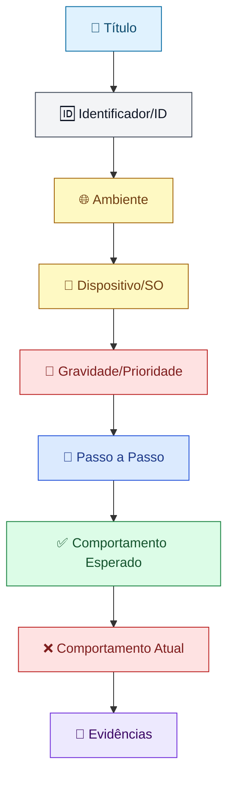

# 🐞 Estrutura de Criação de Bug

Este documento define o padrão utilizado para o registro de bugs neste projeto, garantindo que toda a equipe (QA, Dev e Produto) tenha as informações necessárias para entender, reproduzir e corrigir o defeito com agilidade.

---

## 📐 Estrutura do Reporte



---

## 🔎 Campos do Bug

### 1. Título
Resumo curto e claro do problema, combinando **o que acontece** + **onde acontece**.
> Exemplo: *"Botão de finalizar compra não responde na tela de checkout"*

### 2. Identificador/ID
Código gerado automaticamente pela ferramenta de gestão utilizada (Jira, Trello, Azure DevOps, etc.), usado para rastrear o bug em todo o ciclo de vida.
> Exemplo: `BUG-1042`

### 3. Ambiente
Local onde o erro foi identificado.
- Produção
- Staging
- Homologação

### 4. Dispositivo/SO
Sistema operacional e navegador (ou app) utilizados no momento da reprodução do erro.
> Exemplo: *iOS 17, Safari v17.2* | *Windows 11, Chrome v120*

### 5. Gravidade/Prioridade
Nível de impacto do bug no sistema e no usuário.
| Nível | Descrição |
|---|---|
| 🔴 Bloqueante | Impede o uso da funcionalidade/sistema |
| 🟠 Alta | Impacta fortemente a experiência, mas há contorno |
| 🟡 Média | Impacto moderado, funcionalidade secundária |
| 🟢 Baixa | Impacto visual/cosmético, sem prejuízo funcional |

### 6. Passo a Passo
Lista exata e sequencial das ações necessárias para reproduzir o erro.
```text
1. Acessar a página de login
2. Inserir e-mail e senha válidos
3. Clicar em "Entrar"
4. Observar o comportamento da tela inicial
```

### 7. Comportamento Esperado
Descrição do que deveria acontecer, segundo os requisitos/documentação do sistema.
> Exemplo: *"O usuário deve ser redirecionado para o dashboard após o login."*

### 8. Comportamento Atual
Descrição do que realmente aconteceu, evidenciando o erro.
> Exemplo: *"O usuário permanece na tela de login e nenhuma mensagem de erro é exibida."*

### 9. Evidências
Prints de tela, gravações de vídeo ou logs de console que comprovem o erro.
- 📷 Screenshot(s)
- 🎥 Vídeo de reprodução
- 🧾 Logs de console/servidor

---

## 📝 Template Pronto para Uso

```markdown
## Título
[Resumo curto: o que acontece + onde acontece]

## ID
[Gerado automaticamente pela ferramenta]

## Ambiente
[ ] Produção  [ ] Staging  [ ] Homologação

## Dispositivo/SO
[Sistema operacional e navegador/app + versões]

## Gravidade/Prioridade
[ ] Bloqueante  [ ] Alta  [ ] Média  [ ] Baixa

## Passo a Passo
1. 
2. 
3. 

## Comportamento Esperado


## Comportamento Atual


## Evidências
[Anexar prints, vídeos ou logs]
```

---

*Diagrama gerado com [Mermaid](https://mermaid.js.org/), renderizado automaticamente pelo GitHub.*
